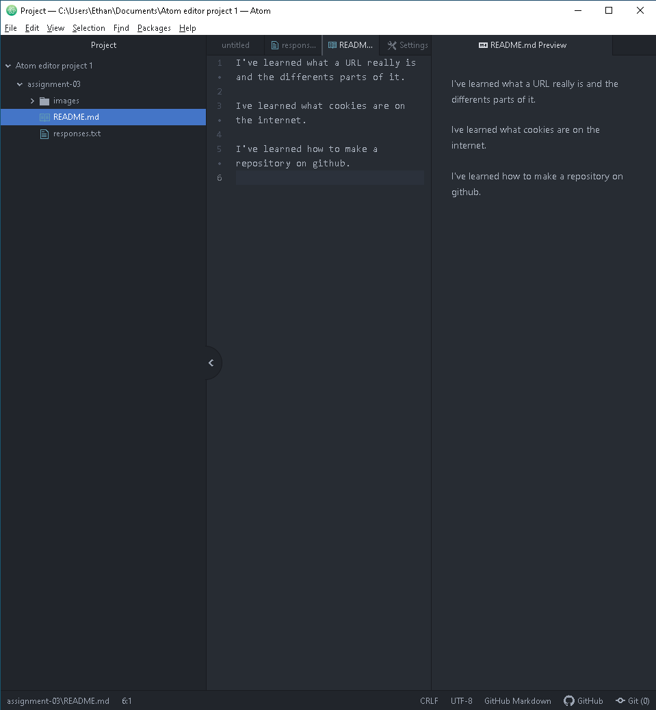

# Things I've learned in class

I've learned what a URL really is and the differents parts of it.

Ive learned what cookies are on the internet.

I've learned how to make a repository on github.

[ResponseFile](./responses.txt)

