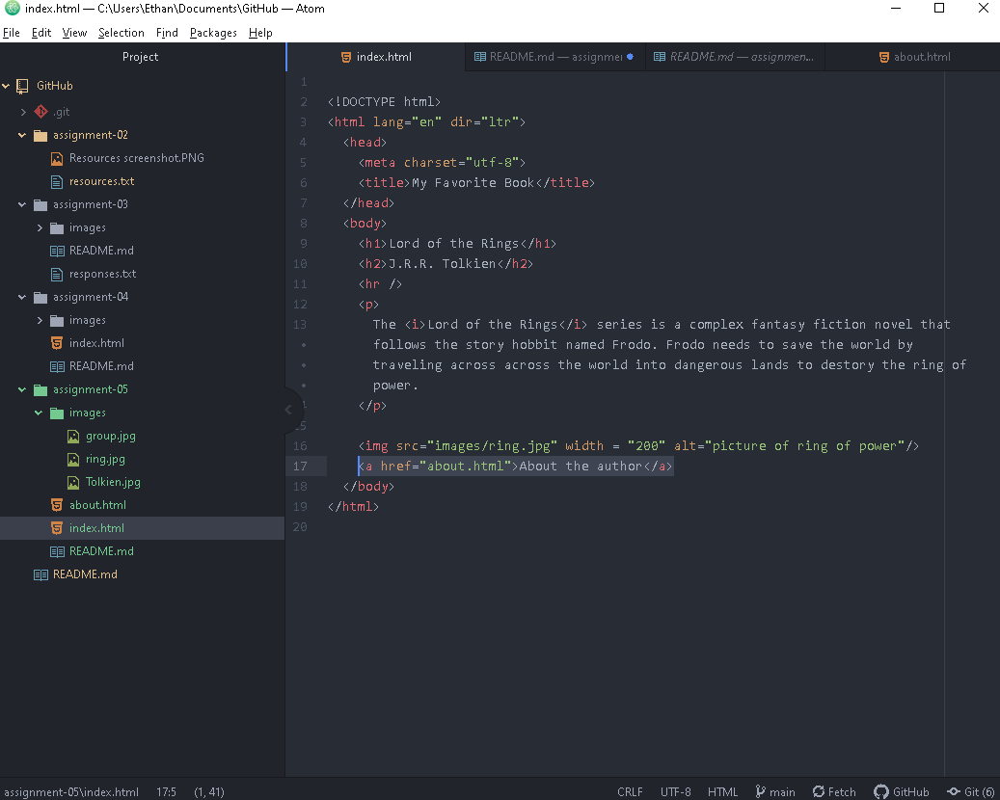

Using the Wayback Machine, I looked up Wizard 101 from the year 2010. The old design uses basic images to promote the game. The modern website uses animations on the website and videos with a cleaner looking UI.

